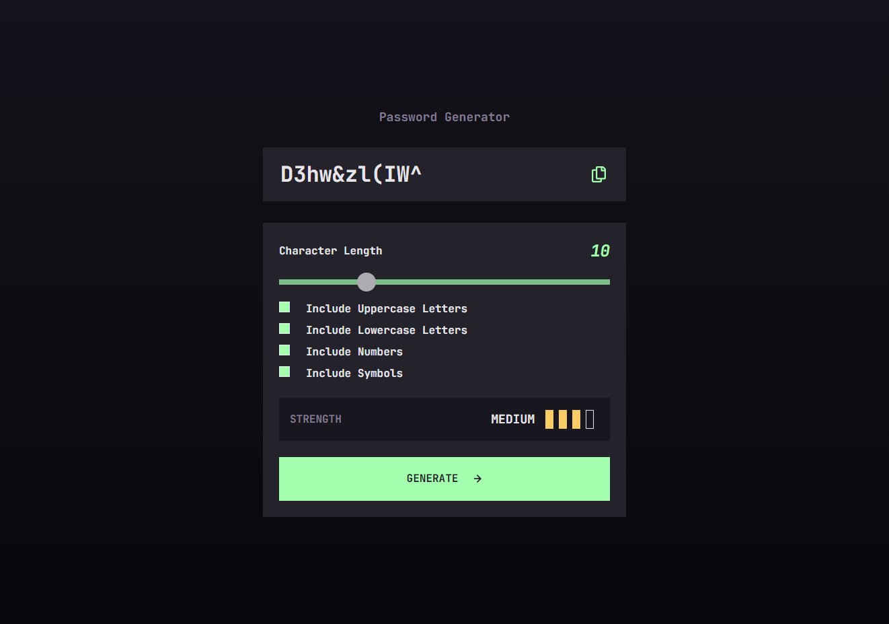

# Frontend Mentor - Password generator app solution

This is a solution to the [Password generator app challenge on Frontend Mentor](https://www.frontendmentor.io/challenges/password-generator-app-Mr8CLycqjh). Frontend Mentor challenges help you improve your coding skills by building realistic projects. 

## Table of contents

- [Overview](#overview)
  - [The challenge](#the-challenge)
  - [Screenshot](#screenshot)
  - [Links](#links)
- [My process](#my-process)
  - [Built with](#built-with)
  - [What I learned](#what-i-learned)
  - [Continued development](#continued-development)
  - [Useful resources](#useful-resources)
- [Author](#author)
- [Acknowledgments](#acknowledgments)

**Note: Delete this note and update the table of contents based on what sections you keep.**

## Overview

### The challenge

Users should be able to:

- Generate a password based on the selected inclusion options
- Copy the generated password to the computer's clipboard
- See a strength rating for their generated password
- View the optimal layout for the interface depending on their device's screen size
- See hover and focus states for all interactive elements on the page

### Screenshot




### Links

- Solution URL: [Add solution URL here](https://your-solution-url.com)
- Live Site URL: [https://pw-gen-flapshatner.vercel.app/](https://pw-gen-flapshatner.vercel.app/)

## My process

I started a new Next.js project and copied my css reset with css custom properties to speed along the process. I then built the basic structure of the app with JSX and styled it according to the style guide. I wrote some JavaScript functions to return a random string depending on whether uppercase, lowercase, numbers and symbols were selected and display the new string at the output of the form. 


### Built with

- JSX markup
- CSS custom properties
- Flexbox
- CSS Grid
- Mobile-first workflow
- [React](https://reactjs.org/) - JS library
- [Next.js](https://nextjs.org/) - React framework


### What I learned

Finding a way to write code that would include uppercase, lowercase, numbers and/or symbols in a group to choose a random string of characters of a specified length was the most interesting part of the process.


```js
export function genPassword(length, isUp, isLow, isNum, isSym) {
  const low = isLow ? 'abcdefghijklmnopqrstuvwxyz' : null
  const up = isUp ? 'ABCDEFGHIJKLMNOPQRSTUVWXYZ' : null
  const num = isNum ? '0123456789' : null
  const sym = isSym ? '!@#$%^&*()' : null

  const string = makeString(low, up, num, sym)

  let newPassword = ''
  for (let i = 0; i <= length; i++) {
    const random = Math.floor(Math.random() * string.length)
    newPassword += string.substring(random, random + 1)
  }

  return newPassword
}
```


### Useful resources

- [Dev.to article](https://dev.to/code_mystery/random-password-generator-using-javascript-6a) - This blog post helped me understand the password generating function.


## Author

- Website - [Jordan Roberts](https://www.jroberts.dev/)
- Frontend Mentor - [@FlapShatner](https://www.frontendmentor.io/profile/FlapShatner)
- Twitter - [@jRobertsWebDev](https://twitter.com/jRobertsWebDev)

